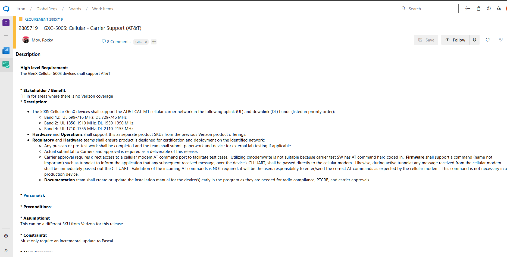
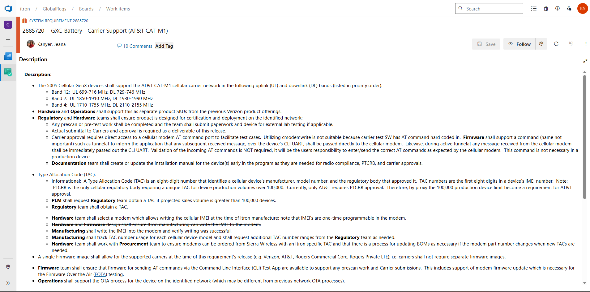
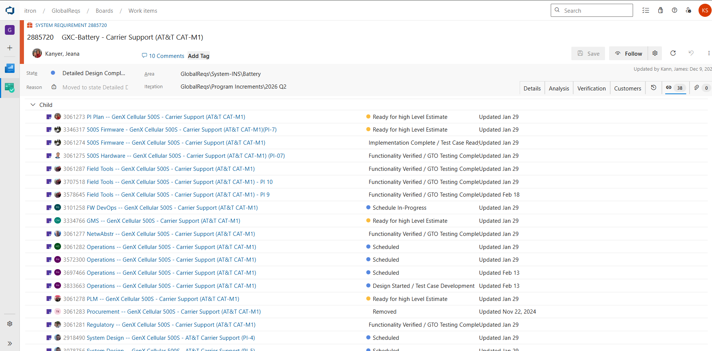
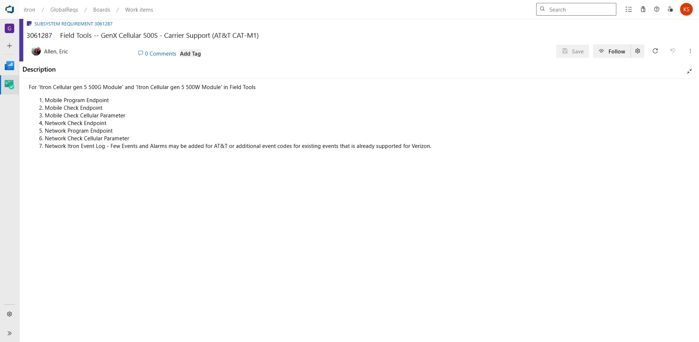
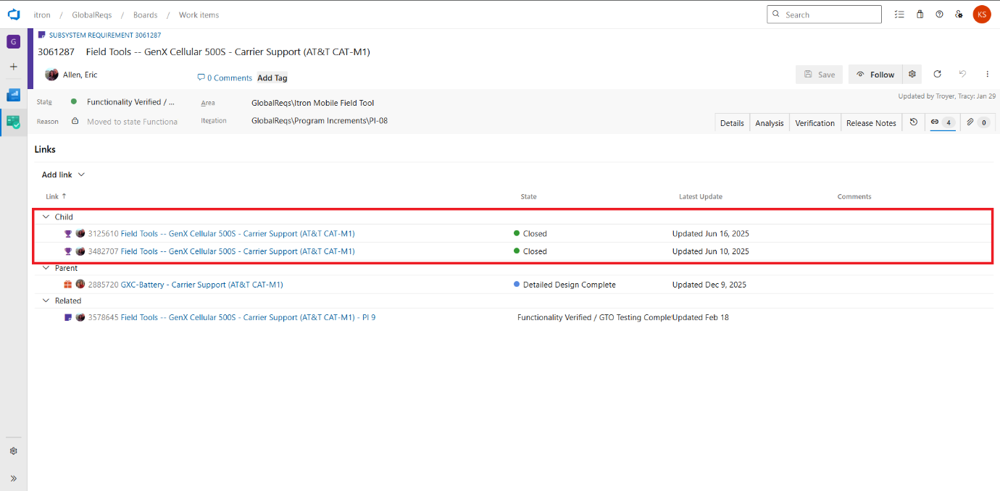
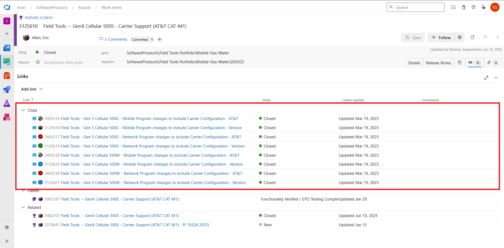
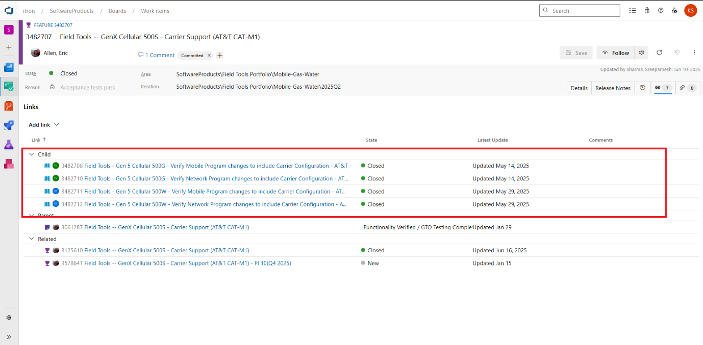
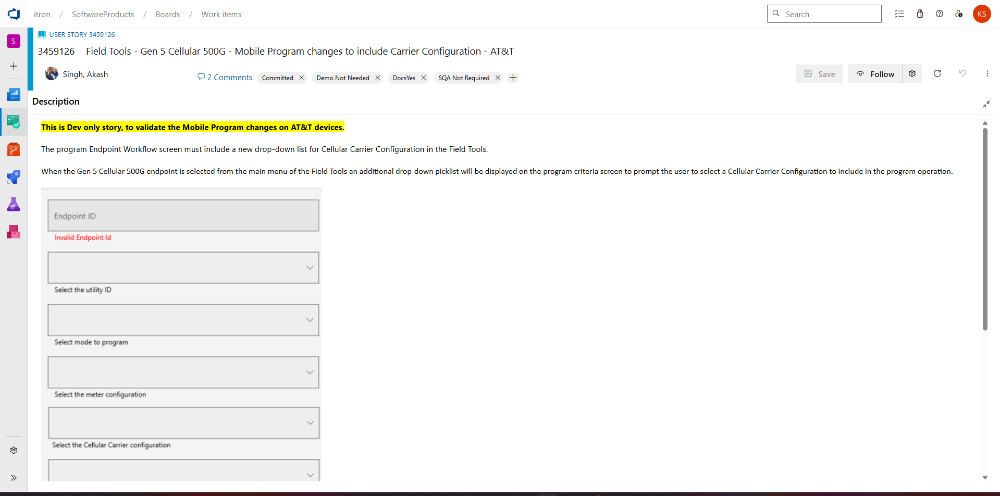
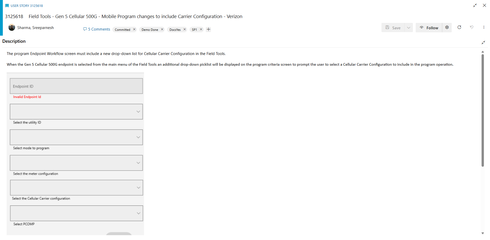

Itron's Requirement Analysis

High-level Process

# Revision History

  -----------------------------------------------------------------------
      **Date**        **Revision**    **Description**      **Author**
  ----------------- ----------------- ----------------- -----------------
     04-08-2026             1         Initial draft of     Srinivas K
                                      requirement       
                                      analysis process. 

     04-10-2026             2         Added additional     Srinivas K
                                      use cases to be   
                                      pursued in the    
                                      conclusion        
                                      section based on  
                                      the feedback.     
  -----------------------------------------------------------------------

# Contents {#contents .TOC-Heading}

[Revision History [2](#revision-history)](#revision-history)

[1. Objective [4](#objective)](#objective)

[2. AI integration in requirement analysis
[4](#ai-integration-in-requirement-analysis)](#ai-integration-in-requirement-analysis)

[3. Walkthrough of requirement analysis with an example
[5](#walkthrough-of-requirement-analysis-with-an-example)](#walkthrough-of-requirement-analysis-with-an-example)

[4. Conclusion [10](#conclusion)](#conclusion)

# Objective

This document provides the high-level requirement analysis process in
Itron. It contains the following steps:

1.  Product Line Manager (PLM) creates marketing requirement
    specification (MRS) in ADO.

2.  System Engineer creates detailed system requirements from MRS.

3.  System Engineer identifies the affected CIs (HW, FW, SW, Test, etc.
    teams) and creates a sub system requirement for each of the CIs.
    \[CI stands for Configuration Item.\]

4.  Technical Program Manager (TPM) or Project Lead (PL) of the CI
    extracts the detailed requirements of the CI and updates the sub
    system requirement.

5.  TPM/PL creates features and user stories in engineering area path
    and do backlog grooming with the team.

6.  The team picks up the features for implementation based on the
    priorities.

We wanted to leverage AI in the above process to accelerate the entire
flow by reducing the manual effort wherever possible.

# AI integration in requirement analysis

The high-level AI integration in the requirement analysis process to
accelerate the flow and reduce the manual effort is as follows:

1.  **Step 1** - PLM uses AI tools (e.g. M365 Copilot) to draft an
    effective MRS.

    - Write a high-level requirement and use M365 Copilot to draft a
      well-structured requirement based on the instructions or the
      examples provided.

2.  **Step 2** -- System Engineer uses AI tools (e.g. M365 Copilot) to
    draft a detailed system requirement based on the discussions with
    PLM.

    - System Engineer uses M365 Copilot to summarize or draft the
      requirements based on discussions with PLM - meeting recordings or
      transcripts.

    - System Engineer uses M365 Copilot to draft well-structured
      requirements based on the instructions and examples provided.

3.  **Step 3** -- System Engineer uses AI solution (?) to create a sub
    system requirement for each of the CIs.

    - We need to identify an AI solution/workflow which helps System
      Engineer to create a sub system requirement for reach of the CIs
      in ADO.

4.  **Step 4** -- TPM/PL extracts the detailed requirement for the CI
    and uses AI tools (e.g. M365 Copilot) to draft well-structured sub
    system requirement for the CI.

    - TPM/PL uses M365 Copilot to summarize or draft the requirements
      based on discussions with System Engineer - meeting recordings or
      transcripts.

    - TPM/PL uses M365 Copilot to draft well-structured requirements
      based on the instructions and examples provided.

5.  **Step 5** -- TPM/PL uses AI solution (?) to create features and
    user stories in engineering area path.

    - We need to identify an AI solution/workflow which helps TPM/PL to
      generate and create features and user stories for the CI in ADO
      (out of the sub system requirement).

    - We want the AI solution/workflow to assist the TPM/PL to do the
      initial effort estimation.

**Summary:**

- In steps 1, 2, and 4 -- we need AI to accelerate the work of
  PLM/System Engineer/TPM. Most of the requirement analysis will be done
  by humans in these steps, they use AI to draft the requirements based
  on their inputs.

- In step 3 -- we need an AI solution to generate and create the
  required sub system requirements for each CI in ADO with System
  Engineers approval.

- In Step 5 -- we need AI solution to generate and create the required
  features and user stories in ADO with TPM/PL's approval.

- In steps 3 and 5, there's a lot of manual effort which can be replaced
  with an AI solution/workflow.

# Walkthrough of requirement analysis with an example

This section covers the requirement analysis process with an example.

1.  Step 1 -- PLM creates an MRS in ADO

- Review 2733439: MRS - GenX Cellular Battery Device Solution

- Review 2715857: MRS - GenX Cellular Battery (03) 500S

- Requirement 2885719: GXC-500S: Cellular - Carrier Support (AT&T)

> {width="6.011421697287839in"
> height="3.053879046369204in"}

2.  Step 2 - System Engineer creates detailed system requirements from
    MRS.

- System Requirement 2885720: GXC-Battery - Carrier Support (AT&T
  CAT-M1)

> {width="6.104898293963255in"
> height="3.0328816710411197in"}

3.  Step 3 - System Engineer identifies the affected CIs (HW, FW, SW,
    Test, etc. teams) and creates a sub system requirement for each of
    the CIs.\
    {width="6.5in"
    height="3.2069444444444444in"}

4.  Step 4 - Technical Program Manager (TPM) or Project Lead (PL) of the
    CI extracts the detailed requirements of the CI and updates the sub
    system requirement.

- SubSystem Requirement 3061287: Field Tools \-- GenX Cellular 500S -
  Carrier Support (AT&T CAT-M1)

> {width="6.013979658792651in"
> height="2.9485203412073493in"}

5.  Step 5 - TPM/PL creates features and user stories in engineering
    area path and do backlog grooming with the team

- Feature 3125610: Field Tools \-- GenX Cellular 500S - Carrier Support
  (AT&T CAT-M1)

  - User Story 3459126: Field Tools - Gen 5 Cellular 500G - Mobile
    Program changes to include Carrier Configuration - AT&T

  - User Story 3125618: Field Tools - Gen 5 Cellular 500G - Mobile
    Program changes to include Carrier Configuration -- Verizon

  - User Story 3459127: Field Tools - Gen 5 Cellular 500G - Network
    Program changes to include Carrier Configuration - AT&T

  - User Story 3125619: Field Tools - Gen 5 Cellular 500G - Network
    Program changes to include Carrier Configuration -- Verizon

- Feature 3482707: Field Tools \-- GenX Cellular 500S - Carrier Support
  (AT&T CAT-M1)

  - User Story 3482708: Field Tools - Gen 5 Cellular 500G - Verify
    Mobile Program changes to include Carrier Configuration - AT&T

  - User Story 3482710: Field Tools - Gen 5 Cellular 500G - Verify
    Network Program changes to include Carrier Configuration - AT&T

  - User Story 3482711: Field Tools - Gen 5 Cellular 500W - Verify
    Mobile Program changes to include Carrier Configuration - AT&T

  - User Story 3482712: Field Tools - Gen 5 Cellular 500W - Verify
    Network Program changes to include Carrier Configuration - AT&T

{width="6.2740419947506565in"
height="3.0840332458442696in"}

{width="6.378151793525809in"
height="3.1433912948381453in"}

{width="6.260504155730533in"
height="3.081330927384077in"}

{width="6.5in"
height="3.227777777777778in"}

{width="6.5in" height="3.19375in"}

6.  Step 6 -- Team will take up the features and user stories for the
    implementation after backlog grooming and prioritization.

# Conclusion

This is a very high-level flow of requirement analysis; our main
objective is to integrate AI solution/workflow in steps 3 and 5 where
there is a lot of manual effort. We can use AI to generate and create
features and user stories and reduce the manual effort in steps 3 and 4.

Additional use cases, we want to pursue after we break down the
requirements into features and user stories:

> 1\. AI solution to cascade any changes in the requirement down till
> the last work item in the chain.
>
> 2\. AI solution to provide the initial estimations for the features
> and user stories based on our historical data.
>
> 3\. AI solution to provide the traceability report and some data
> insights about the project -- predictability, risk, throughput,
> quality, efficiency, etc.
